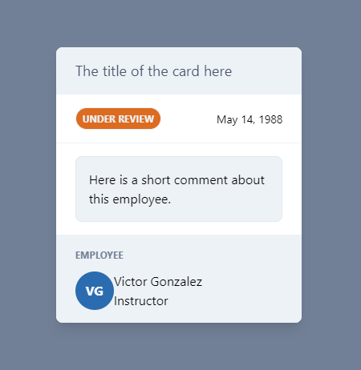
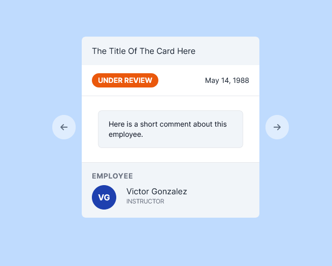

# Employment Card Viewer

This is a simple React application that allows you to view employee details and navigate between employee cards. Built with React and Tailwind.

## Table of Contents
- [Design](#design)
- [Live Preview](#live-preview)
- [Features](#features)
- [Additional Features](#additional-features)
- [Project Structure and Modularity](#project-structure-and-modularity)
- [Links](#links)

## Design
The app's design is based on Scrimba's provided design, with some personal modifications.

## Live Preview

## Features
- View employee cards with details such as name, date of birth, and role.
- Navigate between employee cards using buttons.

## Project Structure and Modularity
To enhance the maintainability and reusability of the project, I've adopted a modular approach:

### `Card` Component

I've created a separate `Card` component, which encapsulates the rendering and styling of individual employee cards. This modular design allows for easy customization and reusability throughout the application.

### Employee Data in JavaScript

To keep the employee data organized and separated from the application's logic, I've stored the employee information in a JavaScript file (`employees.js`). This approach promotes data consistency and simplifies the process of adding, modifying, or updating employee details.

The combination of a modular `Card` component and a separate data file ensures that the project remains flexible and can be extended or reused in various contexts.

## Links
- Live site: (https://employment-card-viewer.netlify.app/)
- Github repository: (https://github.com/amy0h/employment-card-viewer)